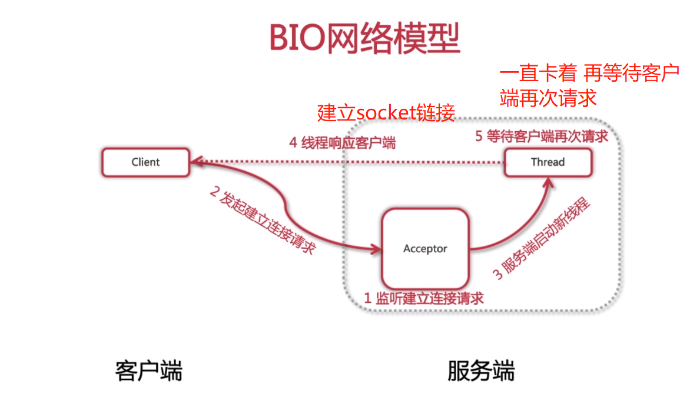
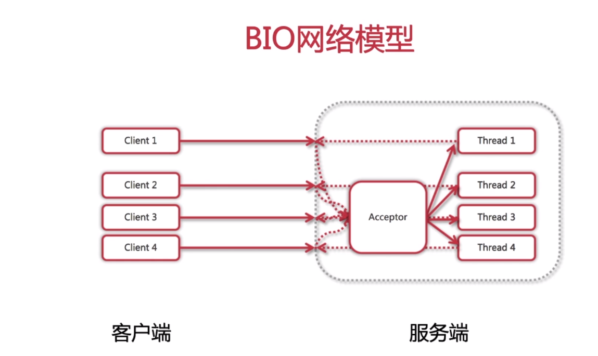
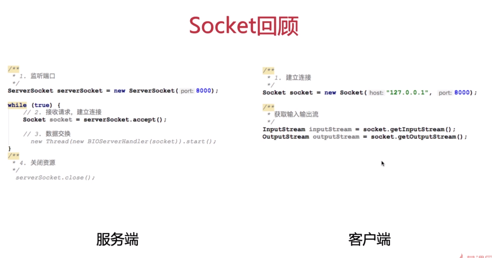

### BIO 网络模型（实际上是阻塞式I/O模型）

##### 客户端发起请求的时候 服务端会为它建立一个socket链接
##### 然后再次等待客户端发起请求 请求结束后才会销毁链接 不然会一直保持着链接
#### 缺点：(弹性伸缩能力查 1：1 ，多线程消耗资源)
##### 对服务器消耗非常大，假设每个线程都是建立了链接然后就没有任何操作。便会无限新建线程 最后导致服务奔溃
  
#### 伪异步I/O编程 （为了改善一对一的连接）
##### 本质上增加了个线程池。由线程池来控制线程的创建（例如使用 FixedThreadPool 控制了它最大创建线程的数量 超过后需要等待之前执行的线程销毁）
