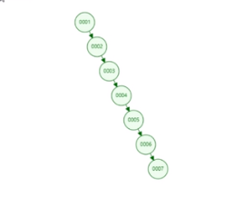
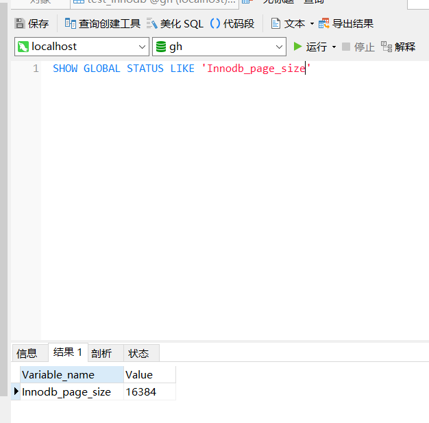
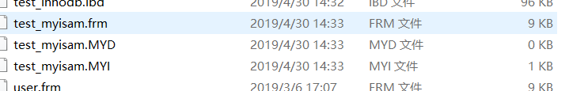
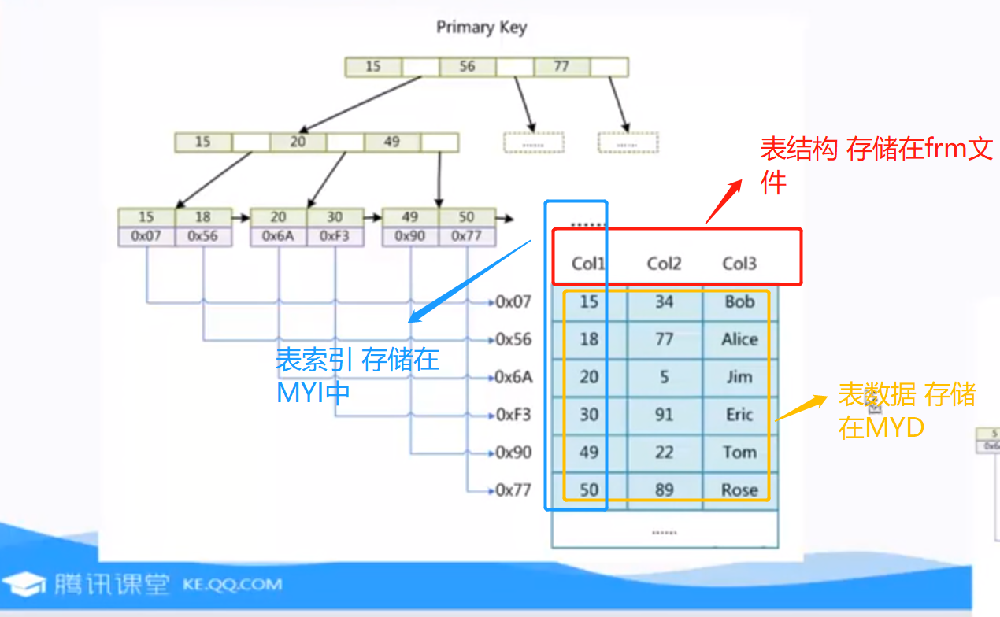
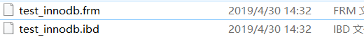
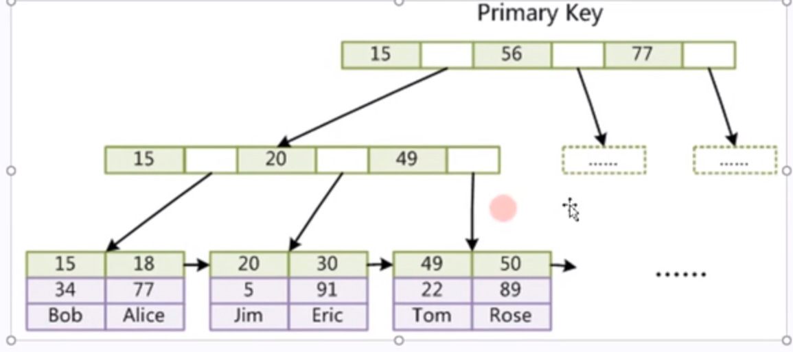
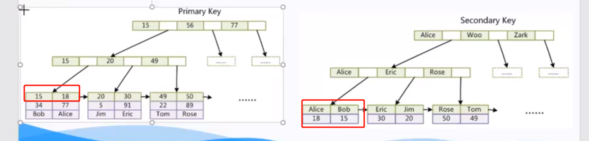

## MySQL 索引

1. 为什么MySQL索引使用B-Tree而不是使用二叉树（红黑树）

   若使用二叉树，在极端情况下会出现没有增加索引一样

   

   若使用红黑树（二叉树的变种）

   

   ​		树的深度也有可能会出现非常大的情况（不可控-大数据量存储的时候）

​		但如果使用B-Tree（可以理解成红黑树上再改造了一波-增加横向存储容量）

2. 但是在MySQL中实际上用的是B+Tree而不是B-Tree

   

   B+Tree的特点

   **只有在叶子节点记录数据** B树是所有的节点都有记录数据 具体可以结合MySQL实例分析

   **非叶子节点只记录一些关键的索引值** 非叶子节点不存储data 可以增加度【原因：减少I/O（增加了横向容量 降低了高度） 既然高度越低越能减少消耗，为什么树的高度不唯一：会出现数据量太大不能全放到内存中】【mysql 官方底层定义一个节点 16k 根据页决定】

   

   

   **叶子节点之间还有指针** 用于解决范围查找

3. MySQL数据文件结尾代表的意思：

   myisam

   

   假设 Col1 作为索引

   

   .frm		表结构

   .MYD	  数据

   .MYI		索引

   假设要查找 49

   首先 查询索引 发现是B+Tree 先经过三次磁盘I/O 查询到49对应的物理地址

   然后再去MYD中查找相应的数据（快速通过文件指针找到数据）

   

   Innodb（**必须要有主键**）

   表数据文件本身就是按照B+Tree组织的一个索引结构文件 就是ibd文件

   

   

   

   **补充：聚集索引**

   聚集索引：将表的索引的值和表的数据聚集存储在一起（比如说innodb）

   非聚集索引：表的索引的值和表的数据不存储在一起（MyISAM）

   
   
   **主键索引**
   
   **非主键索引**（辅助索引 通过非主键索引查找主键索引）
   
   

5. InnoDB 和 MyISAM

   InnoDB 必须要有主键 如果没有的 MySQL后台也会找一个或新建一个作为主键

   同时 主键推荐使用 整形的自增主键  - （工作中有时候用 UUID 有什么不好的地方）

   为什么用整形：

   - UUID 浪费磁盘存储空间，导致每个节点能存储的数据变少 导致索引树增高-从而增加磁盘I/O次数

   - 因为B+Tree需要比大小找值 整型比较大小比UUID比较大小快（UUID需要转换成ASCII然后再比较）

   为什么用自增：

   - 叶子节点从左到右自增 加入数据时候比较方便 直接再后面加 如果不是自增的话 假设叶子节点已经存满了 需要调节 B+Tree 然后再插入数据。所以自增比较好

6. 联合索引

