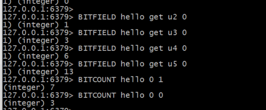
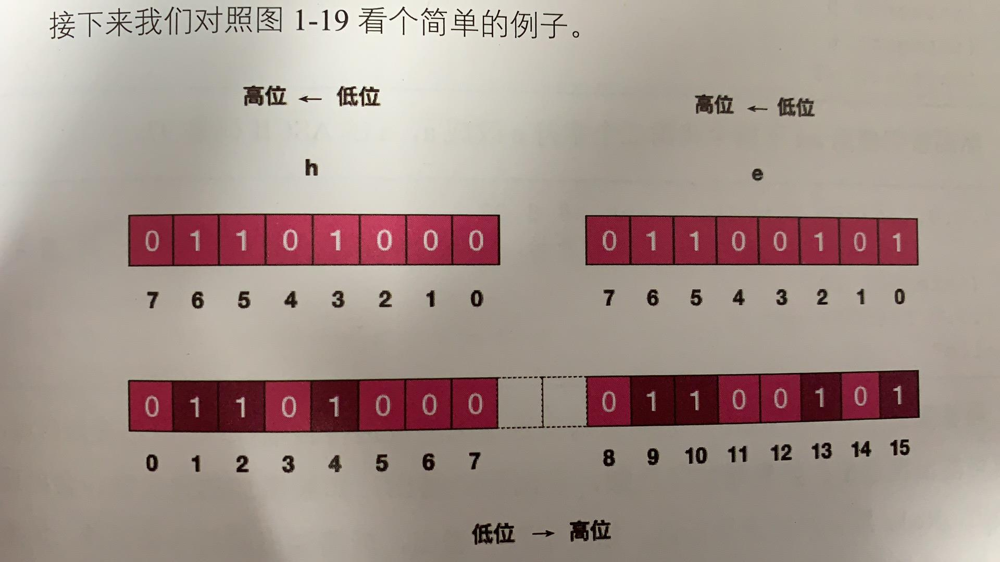

## Redis 位图

- **为什么要使用位图：**

  在我们日常的开发中，会有一些bool型数据需要存取，比如说用户一年的签到记录。签了是1，没签是0，需要记录365天。如果使用普通的key/value。每个用户需要记录365个。当用户数量上亿的时候，需要的存储空间是惊人的。此时Redis提供了位图数据结构。每天的签到记录只占一个位，365天就是365个位，46个字节**（一个稍长一点的字符串）**就可以容纳下。十分节省空间


- 位图的其他使用例子：

```
127.0.0.1:6379> set hello hello
OK
```





BITCOUNT  hello 0 0 	从第一位开始  一位（h）中含有1的个数

BITCOUNT  hello 0 1	从第一位开始  两位（h 和 e）中含有1的个数


```
u 无符号数	i 有符号数
127.0.0.1:6379> BITFIELD hello get u1 0	从图中的第一位（0）开始，一位数（1）代表的无符号数
1) (integer) 0
127.0.0.1:6379> BITFIELD hello get u2 0	从图中的第一位（0）开始，两位数（2）代表的无符号数
1) (integer) 1
127.0.0.1:6379> BITFIELD hello get u3 0
1) (integer) 3
127.0.0.1:6379> BITFIELD hello get u4 0
1) (integer) 6
127.0.0.1:6379> BITFIELD hello get u5 0
1) (integer) 13
（首位为 1 则为负数）
127.0.0.1:6379> BITFIELD hello get i1 0	从图中的第一位开始，一位数代表的有符号数
1) (integer) 0
127.0.0.1:6379> BITFIELD hello get i2 0
1) (integer) 1
127.0.0.1:6379> BITFIELD hello get i3 0
1) (integer) 3
127.0.0.1:6379> BITFIELD hello get i3 1	从图中的第二位开始，三位数代表的有符号数
1) (integer) -2
127.0.0.1:6379>

BITFIELD：
自增操作：
127.0.0.1:6379> BITFIELD hello incrby u4 2 1
1) (integer) 11	当超出15的时候，就会溢出
溢出返回策略：默认当抵达16（溢出的状态），默认就会回到0（折返）
还可以选择饱和截断（保持再最大值）：
127.0.0.1:6379> BITFIELD hello incrby u4 2 1
1) (integer) 15
127.0.0.1:6379>
127.0.0.1:6379> BITFIELD hello overflow sat incrby u4 2 1
1) (integer) 15
或者失败不执行：
127.0.0.1:6379> BITFIELD hello overflow fail incrby u4 2 1
1) (nil)

```

