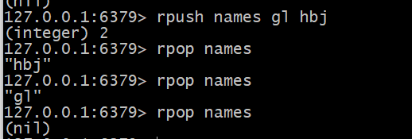

## Redis常用的数据结构

Redis中的数据推荐序列化存储

1. **String字符串**
2. **[List列表](#list)**
3. **Hash字典（相当于Java的HashMap）**
4. **Set 集合（相当于Java的HashSet）**
5. **zset 有序集合（相当于Java的SortedSet和HashMap的结合体）**

- 对于Redis的List补充的内容

  - List来实现队列（右边进左边出）

    List常常可以用来做异步队列：一个线程往List里面塞东西，另一个线程轮询数据进行处理

  例子：
  
  - List也可以用来实现栈（右边进右边出）
  
  例子：
  
  - Redis的列表并不是用LinkedList来实现的，而是使用了一个被成为**快速链表（QuickList）**的结构
  
    工作原理：在列表元素**较少**的时候，使用的是**zipList**（压缩列表。一块**连续的内存存储**，将所有的元素彼此紧挨在一块【ps感觉像数组】）。当数据**比较多**的时候，才会改成**快速链表**。
  
    

- 