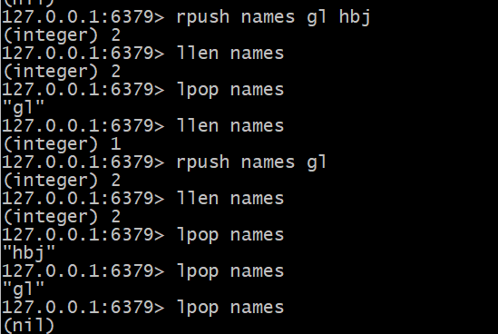
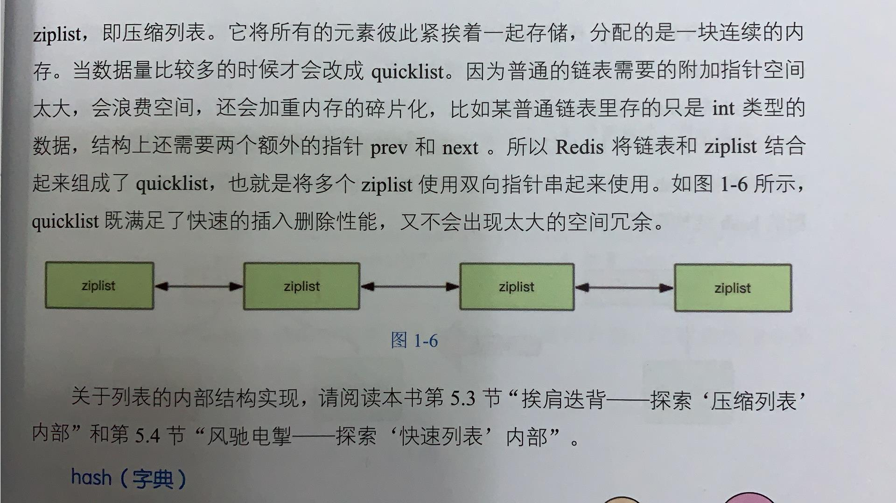
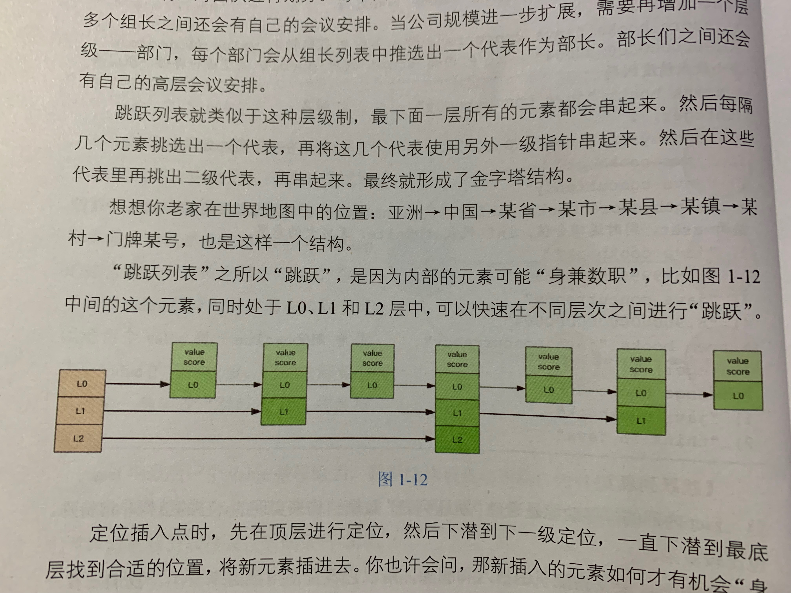

## Redis常用的数据结构

Redis中的数据推荐序列化存储

1. **String字符串**
2. **[List列表](#list)**
3. **[Hash字典](#hash)（相当于Java的HashMap）**
4. **[Set 集合](#set)（相当于Java的HashSet）**
5. **[zset 有序集合](#zset)（相当于Java的SortedSet和HashMap的结合体）**

- 对Redis List补充的内容

  - List来实现队列（右边进左边出）

    List常常可以用来做异步队列：一个线程往List里面塞东西，另一个线程轮询数据进行处理

  例子：
  
  - List也可以用来实现栈（右边进右边出）
  
  例子：
  
  - Redis的列表并不是用LinkedList来实现的，而是使用了一个被成为**快速链表（QuickList）**的结构
  
    工作原理：在列表元素**较少**的时候，使用的是**zipList**（压缩列表。一块**连续的内存存储**，将所有的元素彼此紧挨在一块【ps感觉像数组】）。当数据**比较多**的时候，才会改成**快速链表**。
  
    

- 对Redis hash字典的补充

  **这里主要分析Redis的Hash字典和Java的HashMap的区别：**

  **Redis字典的值只能是字符串，同时它们的rehash的方式不同（rehash不同的原因：Java的HashMap在字典很大时，rehash是一个耗时较大的工作，需要一次性全部rehash。而Redis为了追求高性能，不堵塞服务，所以采用渐进式rehash）**

  - Java HashMap的 rehash 是一次性就将所有的元素搬移到新的位置上

  - Redis的 rehash 采用的是渐进式的 rehash 。查询时会同时查询到两个 hash 结构。然后再后续的定时任务以及 hash 操作指令中，循序渐进地将旧 hash 的内容一点点地迁移到新的 hash 结构中。搬迁完成后，就会使用新的 hash 结构取而代之

- 对Redis set的补充

  内部的实现相当于一个特殊的字典，字典中所有的 value 都是一个值NULL

  例子。可以用来存储在某活动中中奖用户的ID。以保证同一个用户不可以同时中奖两次

- 对Redis zset的补充

  他的结构：一方面是一个 Set 保证了内部 value 的唯一性

  另一方面给每个 value 赋予一个 score 。代表这个 value 的排序权重。内部实现是一种叫做“跳跃列表”的数据结构
  
  Redis 跳表例子：
  
  